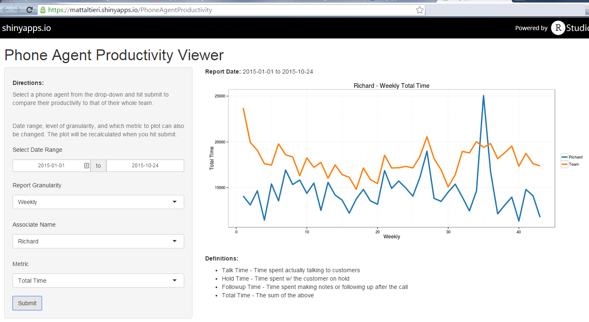
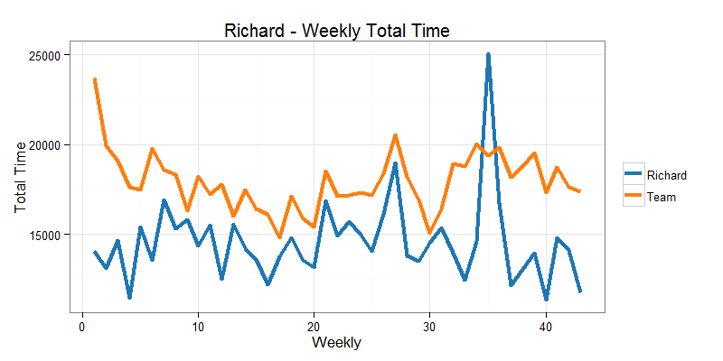

# Phone Agent Productivity

<br />

<br />

### Dynamic Web Reporting using `R` and `Shiny`

---

## The Problem

<br />

### A good call center has three primary goals:

1. Answer as many customer calls as possible
2. In a cost-effective manner
3. While placing an emphasis on customer service

<br />

Meeting these goals depends on effective coaching, and effective coaching depends on robust, agile analytics...

<br />

<span>...</span> but traditional reporting techniques only allow static reports that must be updated and changed manually by a team of analysts.

---

## The Solution

#### Put the power of reporting in management's hands!

With dynamic web reports, each user can generate a custom report -- designed to their requirements -- in seconds!



---

## Under the Hood

#### When `Submit` is clicked, custom code is executed behind the scenes


```r
library(dplyr); library(lubridate)

# Process selected associate's data
assoc.data <- prod.data %>%
    filter(Associate=="Richard" &
               as.Date(Date) >= as.Date("2015-01-01") &
               as.Date(Date) <= as.Date("2015-10-24")) %>%
    group_by(Timeframe=week(Date)) %>%
    summarize(mean.stats=weighted.mean(Total.Time, Calls)) %>%
    mutate(data.type="Richard")

# Process team's data for comparison
sum.data <- prod.data %>%
    filter(as.Date(Date) >= as.Date("2015-01-01") &
               as.Date(Date) <= as.Date("2015-10-24")) %>%
    group_by(Timeframe=week(Date)) %>%
    summarize(mean.stats=weighted.mean(Total.Time, Calls)) %>%
    mutate(data.type="Team")

# Store for plotting
plot.data <- rbind(assoc.data, sum.data)
```

---

## Instant Analytics

#### For the user, the requested analysis displays on the screen _in an instant_


```r
require(ggplot2); require(ggthemes); tableau <- tableau_color_pal("tableau10")(2)

ggplot(data=plot.data, aes(x=Timeframe, y=mean.stats, color=data.type)) +
    geom_line(aes(group=data.type), size=1.5) +
    ggtitle("Richard - Weekly Total Time") + xlab("Weekly") + ylab("Total Time") +
    scale_color_manual(values=tableau) + theme_bw() + guides(col=guide_legend(title=""))
```

<div class="rimage center"></div>
